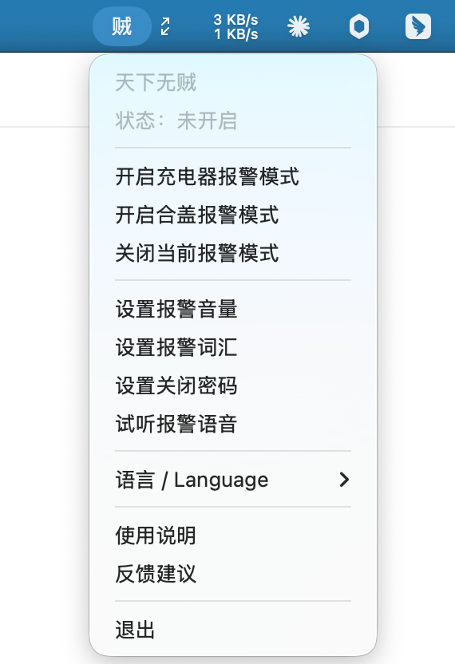

# 天下无贼

一个用 Python 开发的 macOS 菜单栏报警工具。

## 界面预览



## 免责声明

本应用基于兴趣开发，免费提供使用。使用本应用过程中如出现电脑、数据、财物或其他任何损失，开发者不承担任何责任。

本应用的目的只是临时震慑别有用心的人，无法避免被偷，也不能替代个人看管和安全环境。它更像是“防君子不防小人”的提醒工具。电脑仍应尽量放在安全环境中使用和保存，例如我个人一般会选择先锋书店五台山总店这类相对安全的地方临时使用。

社恐者慎用，监控开启情况下，误触会很社死。解决方法：抱着电脑就跑，要是脸皮厚可以优雅地关闭监控。

## 功能

- 电脑监控：拔掉电源或合盖都会触发报警。
- 充电器触发：插回电源后停止播报并继续监控。
- 合盖触发：合盖后锁存报警，开盖后也继续报警，直到验证关闭密码。
- 公共配置：报警音量、报警词汇、报警声音、关闭密码。
- 中英文界面切换，默认中文。
- 任何关闭监控动作都需要关闭密码。
- 报警监控运行期间不允许修改公共配置。

## 当前默认配置

配置文件位置：

```text
~/.tianxiawuzei/config.json
```

默认值：

```json
{
  "alarm_volume": 60,
  "alarm_text": "请不要碰我电脑",
  "close_password": "1111",
  "voice": "Sin-ji",
  "speech_rate": 165,
  "language": "zh"
}
```

## 安装依赖

```bash
cd tianxiawuzei
python3 -m pip install -r requirements.txt
```

## 运行

```bash
cd tianxiawuzei
PYTHONPATH=. python3 -m tianxiawuzei
```

启动后，菜单栏会出现“天下无贼”。

## 电脑监控权限说明

电脑监控包含合盖触发报警，需要临时执行：

```bash
sudo pmset -a disablesleep 1
```

关闭时会恢复：

```bash
sudo pmset -a disablesleep 0
```

因此电脑监控开启或关闭时，macOS 可能要求输入管理员密码。

如果关闭时报警已停，但 `SleepDisabled` 没恢复为 0，App 会提示：

```text
报警已停，但系统设置尚未恢复。
```

此时 App 会自动重试恢复，也可以在菜单栏点击“恢复系统休眠设置”。如果仍然失败，可以手动执行：

```bash
sudo pmset -a disablesleep 0
```

## 运行测试

```bash
cd tianxiawuzei
PYTHONPATH=. python3 -m unittest discover -s tests -v
```

## 打包

```bash
cd tianxiawuzei
python3 -m pip install -r requirements.txt
python3 setup.py py2app
```

打包产物位于：

```text
dist/天下无贼.app
```

## 后续可做

- 加语音选择菜单。
- 增加开机自启动选项。
